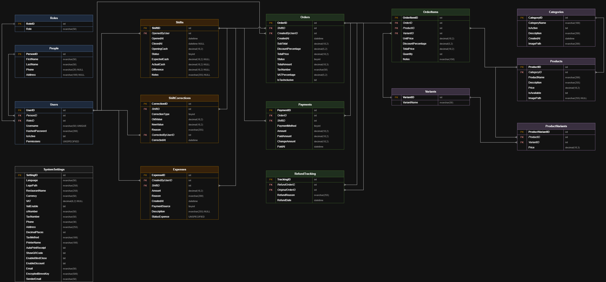

#  تصميم مخطط قاعدة بيانات نظام نقاط البيع والتشغيل (Sawa POS) 🧾
## Point of Sale & Restaurant/Cafe Operations Management System

تصميم شامل لمخطط قاعدة بيانات (Database Schema) مخصص لنظام متكامل لإدارة العمليات التشغيلية، بدءاً من ورديات الموظفين والمخزون، وصولاً إلى معاملات المبيعات والمدفوعات.

---

## 🏗️ معمارية قاعدة البيانات (Database Architecture)

تم بناء النظام بالاعتماد على نموذج قاعدة بيانات علائقية مطبّعة (Normalized Relational Database) صُممت لضمان سلامة وتكامل البيانات (Data Integrity) ودعم سير العمل التشغيلي بكفاءة وقابلية للتوسع.

### 🗄️ مخطط الكيانات والعلاقات (ERD)

> **📥 ملف عالي الدقة:** للاطلاع على التحليل والتفاصيل الهندسية الكاملة، يمكنك تنزيل المخطط بالحجم الكامل: **[مخطط قاعدة البيانات (PDF)](SawaPOS_Schema.drawio.pdf)**.

---

## 🔑 أبرز ميزات المخطط (Key Schema Features)

- 👤 **كيان مركزي للأشخاص (Centralized Person Entity):** جدول أساسي (`People`) يمثل المرجع لبيانات الأفراد، وتعتمد عليه ملفات الموظفين في جدول المستخدمين (`Users`) لضمان عدم تكرار واتساق البيانات.

- 
- 📊 **كتالوج منتجات مطبّع (Normalized Product Catalog):** نموذج منظم يفصل بين الفئات (`Categories`) والمنتجات (`Products`) لضمان سهولة تصنيف المخزون ومرونة التوسع في المنتجات.

- 
- 🕒 **تتبع تشغيلي شامل (Comprehensive Operational Tracking):** جداول متكاملة لإدارة ورديات العمل (`Shifts`)، المصروفات التشغيلية (`Expenses`)، والمشتريات (`Purchases`) مع ربط كل حركة بالموظف المسؤول.

- 
- 💼 **إدارة دورة حياة المبيعات بالكامل (Full Sales Lifecycle):** معالجة دقيقة لحالات الطلبات (`Orders`)، تفصيل بنود الفاتورة بالأسعار التاريخية داخل (`OrderItems`)، وربطها بعمليات الدفع المتعددة (`Payments`).
- 
- 📝 **إعدادات النظام وقابلية التدقيق (Auditability & Configuration):** ضبط مركزي لخصائص المنشأة والضرائب عبر (`System Settings`)، وجدول مخصص لسجلات العمليات (`Audit Logs`) لتتبع الحركات الحساسة.

---

## 🛠️ التقنيات والمفاهيم المستخدمة (Technologies & Concepts)

- **نموذج التصميم:** تصميم قواعد البيانات العلائقية (Relational Database Design - ERD).
- **المفاهيم الأساسية:** تطبيع البيانات (Normalization)، قيود المفاتيح الأجنبية وتكامل المراجع (Foreign Key Constraints)، وإدارة حالات الكيانات (State Management) لحالات الطلب والوردية.

---

