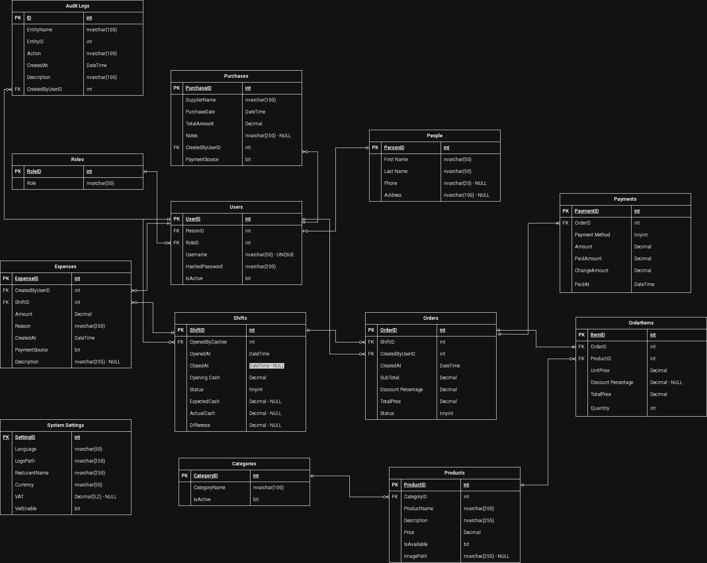

# 🛍️ Operational Retail & POS System Database Schema Design 🛒

A comprehensive Database Schema Design for an integrated system managing retail operations, from staff shifts and inventory to sales transactions and payments.

---

## 🏗️ Database Architecture
The system is built on a normalized relational database model designed to ensure data integrity and scalable operational workflow management.

### Entity Relationship Diagram (ERD)

> **📥 High-Resolution Resource:** For detailed analysis, you can download the full-scale [Database Schema (PDF)](POS System Schema.drawio (2).pdf).

---

## 🔑 Key Schema Features

*   👤 **Centralized Person Entity:** A core `People` table serving as the foundation for staff profiles within the `Users` entity to maintain data consistency.
*   📊 **normalized Product Catalog:** Structured data model for `Categories` and `Products` to ensure organized inventory and scalable catalog management.
*   🕒 **Comprehensive Operational Tracking:** Integrated tables for managing employee `Shifts`, operational `Expenses`, and stock `Purchases` with staff audit trail.
*   💼 **Full Sales Lifecycle Management:** Robust handling of customer `Orders`, detailed line-item information in `OrderItems`, and linked `Payments` processing.
*   📝 **Auditability & System Configuration:** Centralized `System Settings` and a detailed `Audit Logs` table to track critical system actions and user activities.

## 🛠️ Technologies Used

*   **Design Model:** Relational Database Design (ERD).
*   **Core Concepts:** Normalization, Foreign Key Constraints, and State Management (e.g., for Shift Status, Order Status).

---
*This database schema was designed to support a full-featured Operational Retail or Point-of-Sale application.*
